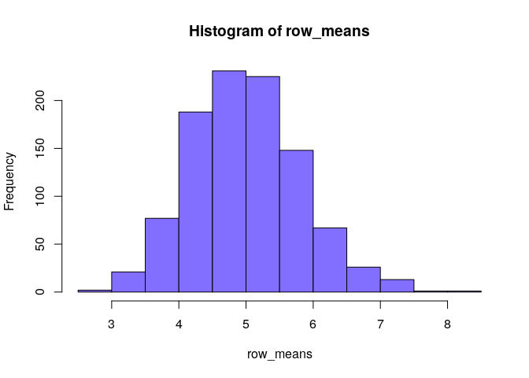

Inferential Statistics Simulation
================
Victor Wildner

> In this simulation we are doing a quick overview investigation of the
> exponential distribution and comparison with the Central Limit
> Theorem. We will investigate the distribution of averages of 40
> exponentials from a thousand simulations (i.e. 1000x40 matrix). The
> project is set in literate programming, allowing full research
> reproducibility.

## Tools Used

  - R language compiler
  - R base graphic devices
  - Tidyverse library packages
  - RMarkdown library package
  - Knitr library
    package

## Files

  - **[CODEBOOK](https://github.com/vcwild/infsim/blob/master/infsim.pdf)**:
    step-by-step book explaining the code
    processing.
  - **[Figures](https://github.com/vcwild/infsim/tree/master/infsim_files/figure-gfm)**:
    the plotted
    images
  - **[Infsim.Rmd](https://github.com/vcwild/infsim/blob/master/infsim.Rmd)**:
    the script to compile the project from source

## Build from Source

Inside the project root folder, execute the following

    R
    library(rmarkdown)
    rmarkdown::render("infsim.Rmd", "html_document")

# CODEBOOK

## Setup

``` r
knitr::opts_chunk$set(echo = TRUE, cache = TRUE)
require(ggplot2)
```

    ## Loading required package: ggplot2

``` r
require(knitr)
```

    ## Loading required package: knitr

``` r
set.seed(144)
```

## Simulations

### Params

``` r
n = 40
lambda = 0.2
simulations = 1000

distro <- matrix(
    rexp(n * simulations, lambda), simulations
    )
```

### Stats

``` r
# Means
row_means <- apply(distro, 1, mean)
calc_mean <- mean(row_means)
exp_mean <- 1/lambda
# Standard deviation
calc_sd <- sd(row_means)
exp_sd <- 1/lambda * 1/sqrt(n)
# Variance
calc_var <- calc_sd^2
exp_var <- exp_sd^2
```

The calculated mean is **4.998** and the expected mean is **5**, meaning
the simulation result is approximately the same as E(x).

``` r
hist(row_means, col = "slateblue1")
```

<!-- -->

The simulation standard deviation is **0.807** and the expected sd is
**0.791**.

The calculated variance is **0.652** and the expected is **0.625**,
meaning the variance of the simulation has approximately the same spread
as expected by the CLT.

## Plotting the Comparison

``` r
df_rmeans <- data.frame(row_means)

ggplot(df_rmeans, aes(x = row_means)) +
    geom_histogram(
        binwidth = lambda, 
        fill = "slateblue3", 
        color = "black",
        alpha = .5,
        aes(y = ..density..)) +
    stat_function(
        fun = dnorm, 
        args = list(mean = exp_mean, sd = exp_sd), 
        color = "cyan", 
        linetype = "dashed", 
        size = 1) +
    geom_vline(
        xintercept = exp_mean, 
        color = "cyan", 
        size = 1) +
    stat_function(
        fun = dnorm, 
        args = list(mean = calc_mean, sd = calc_sd), 
        color = "slateblue1") +
    geom_vline(xintercept = calc_mean) +
    labs(
        title = "Random Exponential Distribution of 40 Exponentials",
        x = " Row Mean",
        y = ""
    ) +
    theme_minimal()
```

<!-- -->

``` r
qqnorm(row_means)
qqline(row_means, col = "red")
```

<!-- -->

By the comparison, the sample distribution (darker) is iid distributed,
being almost identical to the theoretical distribution (cyan), therefore
agreeing with the Central Limit Theorem.
